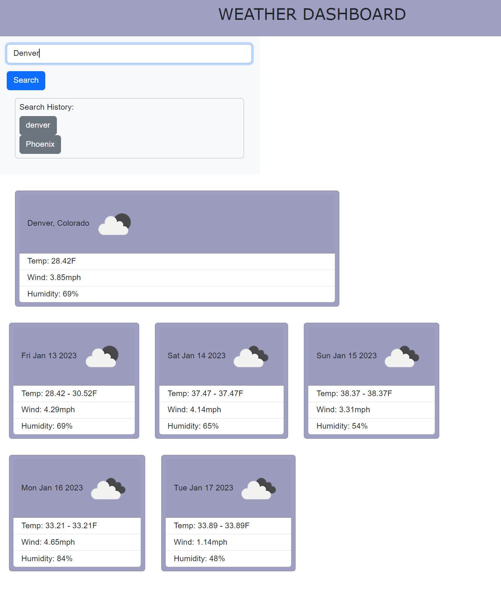

# Bootcamp-Challenge6-WeatherApp
UT Austin coding bootcamp challenge 6 weather app

## Description

The following website is a weather dashboard that will allow users to search for a city and see the current weather and a 5 day forecast. The search history is logged on each search.  the weather data includes the temp, wind, humidity, and current conditions (in the form of an icon).

## Installation

N/A

## Usage

Go to the following URL:
https://airen22.github.io/Bootcamp-Challenge6-WeatherApp/

The following image shows a screenshot of the website: 

## Credits

Karen Peazzoni: https://github.com/kpeazzoni/

## License

Please refer to the LICENSE in the repo.
